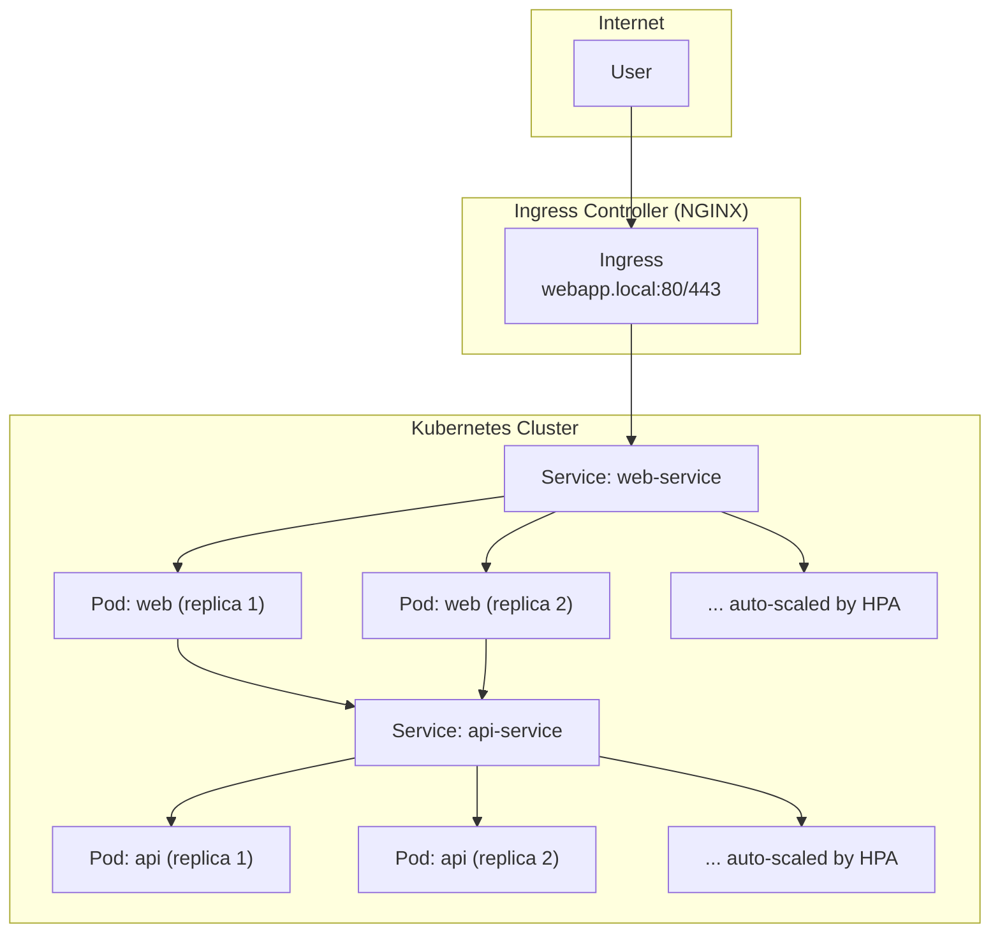

# Taffy 🍬

The ultimate AI assistant for UI/UX Designers

## What is Taffy?

Taffy is an AI-powered assistant designed specifically for UI/UX designers working with Figma. It helps designers save significant time and effort in managing their design files by allowing them to chat directly with their designs, get UI/UX insights, and make design changes across multiple components with simple commands.

With Taffy, designers can:

- Identify potential drop-off points in user journeys to reduce churn in conversion flows
- Make file-wide changes (like updating all button colors) in one go
- Get AI-powered design feedback and suggestions
- Automate repetitive design management tasks

The average designer spends up to 20% of their week on design file management, costing organizations approximately $15,000 per designer annually. Taffy aims to reclaim this time and reduce costs by streamlining the design workflow through intuitive AI assistance.

Powered by Alibaba Cloud's Qwen LLM and built with a scalable Kubernetes architecture, Taffy brings enterprise-grade AI capabilities directly to designers' fingertips. Whether you're managing simple landing pages or complex design systems with hundreds of components, Taffy helps you focus more on creative work and less on file management.

## Architecture

The backend and frontends are stateless. For the initial MVP, there was no need for a database as we do not persist any information. In subsequent versions, the main source of truth will be the database, which is already scalable by itself.



### Alibaba Cloud Integration

Alibaba Cloud Model Studio - Used to setup access to QWEN LLM for checking the quality of figma designs
Elastic Compute Service - Used to deploy the backend services, important for scalability because of long running streaming requests to clients
Alibaba Cloud AI and Machine Learning Platform (PAI) - Future work to use this for fine tuning model to better understand Figma designs with less tokens, saving on running costs
Qwen LLM - Used for inference and getting suggestions for improving user's figma designs
Alibaba Kubernetes Services - Future work to use this in conjunction with ECS for horizontal scaling of backend services

### Scalability

In the case that our single backend and frontends get overloaded, we can easily add Horizontal auto scaling to our kubernetes setup to take advantage of making new pods on Alibaba cloud.

That way, when a high CPU load is detected, it will spin up more frontend services/backend services as required.

```
kubectl autoscale deployment web-deployment \
  --cpu-percent=50 \
  --min=1 \
  --max=5
```

When more pods are available, the incoming requests are sent round-robin to each pod, so that each pod has takes on an even load of the incoming traffic.

### Security

All streaming requests are passing from the frontend to the backend, in order to avoid exposing our API keys.
Future work is to add login/logout authentication and headers in order to prevent arbitrary users from abusing our LLM API requests.
